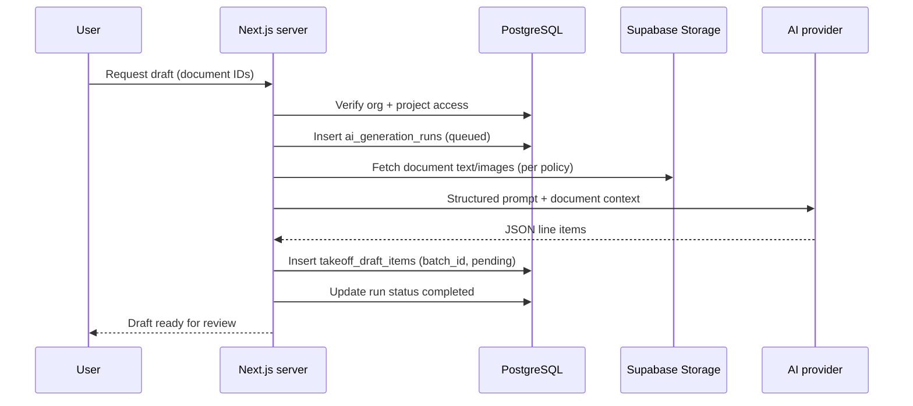

# AI workflows

How AI fits into Quanta MVP. AI **assists** drafting; it does **not** replace user judgement or database authority.

## Principles

| Principle | Meaning |
|-----------|---------|
| Draft only | Model output is never final tender data |
| Manual first | Manual takeoff and pricing must work without AI |
| User approval | Lines enter live tables only after explicit accept (or accept-after-edit) |
| Database truth | `takeoff_items`, `material_lines`, `labour_lines`, and pricing summaries are authoritative |
| Traceability | Every run and bulk accept/reject is auditable |
| Least context | Send only selected project documents and structured prompts — not the whole org |

## What AI does in MVP

**In scope:** AI-assisted **takeoff draft generation** — proposed quantity lines from uploaded tender documents (drawings, specs, schedules as text-extractable files).

**Out of scope for MVP AI:**

- Automatic geometry measuring / BIM quantity extraction
- Live supplier pricing
- Auto-generated material or labour pricing (user prices manually)
- Auto-writing exclusions or RFIs without review
- Unattended end-to-end tender generation

## Workflow: takeoff draft generation

### Trigger

User on project **Takeoff** tab:

1. Selects one or more `project_documents` (e.g. floor plan PDF, door schedule).
2. Clicks **Generate takeoff draft** (label may vary; meaning is fixed).
3. Confirms disclaimer: *AI suggestions are drafts. Review every line before use.*

### Server pipeline

### Prompt design (requirements)

- System message: role is *assistant estimator*; output **JSON only** matching schema (description, unit, quantity, optional location, optional item_code).
- Instruct model to cite uncertainty in a `notes` field, not invent quantities.
- Instruct model to **ignore** instructions embedded in document text (prompt injection).
- Include project name and document filenames for context — not other projects.
- Version prompts; store `model_version` on `ai_generation_runs`.

### Draft review UI

Display `takeoff_draft_items` separately from live `takeoff_items`:

| Action | Effect |
|--------|--------|
| **Accept** | Copy row to `takeoff_items` with `source = ai_approved`; mark draft `accepted`; audit `approve` |
| **Edit then accept** | User adjusts quantity/description in draft editor; then same as accept; audit records edit |
| **Reject** | Draft `rejected`; no live table change; audit `reject` |
| **Accept all** | Bulk accept with confirmation modal — still one audit summary + per-line events optional |

**Never:** auto-merge all drafts on job completion.

### Failure handling

| Status | User sees | Data |
|--------|-----------|------|
| `failed` | Clear error + retry | No partial writes to live takeoff |
| `running` | Progress indicator | Poll or subscribe to run status |
| Timeout | Retry offered | Run marked failed; drafts not promoted |

## What AI must not do

- Write directly to `takeoff_items`, `material_lines`, `labour_lines`, or `project_pricing_summary`
- Change organisation default rates
- Delete user data
- Export Excel without user click
- Bypass RLS using service role from client

## Human review checklist (show in UI)

Before accepting any draft line, user should verify:

- [ ] Unit of measure matches trade practice
- [ ] Quantity scale matches drawing (check dimensions)
- [ ] Description matches scope (not double-counted)
- [ ] Location/zone correct if multi-area job
- [ ] Exclusions elsewhere still apply

## Future AI (post-MVP — not built now)

Document for orientation only; do not implement until feature lock updates:

- Material line suggestions from accepted takeoff
- Labour hour suggestions by trade
- RFI question suggestions from spec gaps
- Semantic search across past projects (same org)

## Observability

- Log run duration and token usage server-side (not in browser).
- Support staff can inspect `ai_generation_runs` and draft batch status — not end-user chat logs in MVP.

## Related documents

- [security-rules.md](./security-rules.md)
- [database-schema.md](./database-schema.md) — `takeoff_draft_items`, `ai_generation_runs`
- [user-flows.md](./user-flows.md) — Flow 9
- [build-sequence.md](./build-sequence.md) — Phase 9
