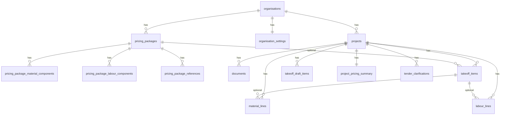

# Database schema

Conceptual schema for the Quanta MVP. Implementation uses **PostgreSQL** via **Supabase** with **Row Level Security (RLS)** on all tenant tables.

Naming convention: `snake_case` tables and columns; UUID primary keys; `timestamptz` for dates; monetary values as `numeric` (never float).

## Tenancy model

Every business object is scoped to an **organisation**. A user belongs to one organisation in MVP.

```
auth.users
    └── profiles (id, organisation_id, role)
            └── organisations
                    └── [all project and settings data]
```

### Profile roles

| Role | Purpose |
|------|---------|
| `owner` | Created the organisation; full control |
| `admin` | Manage team and settings (future) |
| `estimator` | Create and edit tenders |
| `viewer` | Read-only access (future) |

Users without `organisation_id` must complete `/onboarding` before accessing the app.

## Core entities

### profiles

User profile linked to Supabase Auth.

| Column | Type | Notes |
|--------|------|-------|
| id | uuid | PK, FK → auth.users |
| email | text | |
| full_name | text | Optional until onboarding |
| organisation_id | uuid | Nullable until onboarding complete |
| role | text | Nullable until onboarding; `owner`, `admin`, `estimator`, `viewer` |
| created_at, updated_at | timestamptz | |

### organisation_invites

Token-based invites for joining an organisation (MVP).

| Column | Type | Notes |
|--------|------|-------|
| id | uuid | PK |
| organisation_id | uuid | FK |
| token | text | Unique invite token |
| email | text | Optional restrict to email |
| role | text | `owner`, `admin`, `estimator`, `viewer` |
| status | text | `pending`, `accepted`, `revoked`, `expired` |
| invited_by | uuid | FK → auth.users |
| expires_at | timestamptz | Optional |
| accepted_at | timestamptz | |
| accepted_by | uuid | FK → auth.users |
| created_at, updated_at | timestamptz | |

Invite acceptance is performed via secure server paths only.

### organisations

Company profile shown on exports and used for defaults.

| Column | Type | Notes |
|--------|------|-------|
| id | uuid | PK |
| name | text | Trading name |
| legal_name | text | Optional |
| abn_or_company_number | text | Optional, region-specific |
| address, phone, email | text | Contact block for exports |
| logo_url | text | Supabase Storage path |
| default_currency | text | e.g. `AUD`, `GBP` |
| created_at, updated_at | timestamptz | |

### organisation_settings

Default rates and pricing behaviour (MVP “basic settings”).

| Column | Type | Notes |
|--------|------|-------|
| organisation_id | uuid | PK/FK |
| default_labour_rate | numeric | Per hour or unit — document in UI |
| default_margin_percent | numeric | |
| default_markup_percent | numeric | |
| overhead_percent | numeric | Optional |
| wastage_percent_default | numeric | Optional, overridable per line |
| created_at, updated_at | timestamptz | |

### projects

One tender/job estimate.

| Column | Type | Notes |
|--------|------|-------|
| id | uuid | PK |
| organisation_id | uuid | FK, indexed |
| name | text | e.g. “Level 3 fitout — Smith St” |
| reference | text | Client or internal job number |
| client_name | text | |
| site_address | text | Optional |
| tender_due_date | date | Optional |
| status | enum | `draft`, `in_review`, `submitted`, `won`, `lost`, `archived` |
| notes | text | Internal |
| created_by | uuid | FK → auth.users |
| created_at, updated_at | timestamptz | |

### documents

Tender files uploaded to a project (Storage object + metadata). Private bucket `project-documents`; path `{organisation_id}/{project_id}/{file_name}`.

| Column | Type | Notes |
|--------|------|-------|
| id | uuid | PK |
| organisation_id | uuid | FK (denormalised for RLS) |
| project_id | uuid | FK |
| file_name | text | Original filename |
| storage_path | text | Supabase Storage key |
| file_type | text | MIME type |
| document_type | enum | `architectural_drawings`, `structural_drawings`, `specification`, `schedule`, `scope_document`, `photos_images`, `other` |
| page_count | integer | Optional |
| processing_status | enum | `pending`, `ready`, `failed` |
| ai_summary | text | Optional; AI not used in MVP upload |
| uploaded_by | uuid | FK → auth.users |
| created_at | timestamptz | |

### project_documents (legacy name in early docs)

Superseded by `documents` for MVP implementation. See `documents` above.

### takeoff_items (manual takeoff table)

Quantity lines for manual takeoff. Manual entry is source of truth; AI drafts use a separate table.

| Column | Type | Notes |
|--------|------|-------|
| id | uuid | PK |
| organisation_id | uuid | FK (denormalised for RLS) |
| project_id | uuid | FK |
| source_document_id | uuid | Optional FK → documents |
| pricing_package_id | uuid | Nullable FK → pricing_packages; set when user applies a package |
| package_applied_at | timestamptz | Optional; when package last exploded |
| trade | text | e.g. Carpentry, Ceilings, or custom |
| item_name | text | Line item title |
| description | text | Scope detail |
| quantity | numeric | User-entered, ≥ 0 |
| unit | text | sqm, lm, each, custom, etc. |
| drawing_reference | text | Drawing number |
| page_number | integer | Optional page on linked drawing |
| confidence_score | numeric | Optional 0–1 (AI only in future) |
| ai_generated | boolean | Default false for manual |
| reviewed | boolean | User verification flag |
| status | enum | `ai_draft`, `needs_review`, `reviewed`, `priced`, `excluded` |
| notes | text | Internal |
| sort_order | integer | Row ordering |
| created_at, updated_at | timestamptz | |

### takeoff_draft_items (AI-assisted takeoff — not live until approved)

Staging area for AI proposals.

| Column | Type | Notes |
|--------|------|-------|
| id | uuid | PK |
| project_id | uuid | FK |
| organisation_id | uuid | FK |
| batch_id | uuid | Groups one AI run |
| description, unit, quantity | | Proposed values |
| confidence | numeric | Optional 0–1 |
| source_document_id | uuid | Optional FK |
| status | enum | `pending`, `accepted`, `rejected`, `edited` |
| created_at | timestamptz | |

### material_lines

Material takeoff / pricing lines linked to takeoff where useful.

| Column | Type | Notes |
|--------|------|-------|
| id | uuid | PK |
| project_id | uuid | FK |
| organisation_id | uuid | FK |
| takeoff_item_id | uuid | Nullable FK |
| pricing_package_id | uuid | Nullable FK; lineage when line came from package explosion |
| source | enum | `manual`, `package_explosion` — default `manual` |
| description | text | |
| unit | text | |
| quantity | numeric | |
| unit_cost | numeric | |
| wastage_percent | numeric | |
| line_total | numeric | Stored or computed in app layer |
| sort_order | integer | |
| created_at, updated_at | timestamptz | |

### labour_lines

Labour build-up lines.

| Column | Type | Notes |
|--------|------|-------|
| id | uuid | PK |
| project_id | uuid | FK |
| organisation_id | uuid | FK |
| takeoff_item_id | uuid | Nullable FK |
| pricing_package_id | uuid | Nullable FK; lineage when from package explosion |
| source | enum | `manual`, `package_explosion` |
| trade_or_role | text | e.g. “Ceiling fixer” |
| description | text | |
| hours_or_units | numeric | |
| rate | numeric | |
| line_total | numeric | |
| sort_order | integer | |
| created_at, updated_at | timestamptz | |

### project_pricing_summary

Cached totals for workspace header and export (recalculated on save).

| Column | Type | Notes |
|--------|------|-------|
| project_id | uuid | PK |
| organisation_id | uuid | FK |
| materials_subtotal | numeric | |
| labour_subtotal | numeric | |
| direct_cost_total | numeric | |
| margin_percent | numeric | Project override |
| markup_percent | numeric | Project override |
| margin_amount | numeric | |
| sell_price_total | numeric | |
| updated_at | timestamptz | |

### tender_clarifications

Exclusions, assumptions, and RFIs in one table with a type discriminator.

| Column | Type | Notes |
|--------|------|-------|
| id | uuid | PK |
| project_id | uuid | FK |
| organisation_id | uuid | FK |
| type | enum | `exclusion`, `assumption`, `rfi` |
| title | text | |
| body | text | |
| status | enum | For RFIs: `open`, `answered`, `closed` |
| sort_order | integer | |
| created_at, updated_at | timestamptz | |

### audit_events

Immutable log of user and system actions.

| Column | Type | Notes |
|--------|------|-------|
| id | uuid | PK |
| organisation_id | uuid | FK |
| project_id | uuid | Nullable FK |
| user_id | uuid | Nullable for system |
| entity_type | text | e.g. `takeoff_item`, `material_line` |
| entity_id | uuid | |
| action | enum | `create`, `update`, `delete`, `approve`, `reject`, `export` |
| before_json | jsonb | Optional snapshot |
| after_json | jsonb | Optional snapshot |
| summary | text | Human-readable |
| created_at | timestamptz | |

### ai_generation_runs

Track AI jobs for debugging and audit (no secrets in rows).

| Column | Type | Notes |
|--------|------|-------|
| id | uuid | PK |
| project_id | uuid | FK |
| organisation_id | uuid | FK |
| run_type | enum | `takeoff_draft`, `package_suggestion` (future) |
| status | enum | `queued`, `running`, `completed`, `failed` |
| model_version | text | |
| input_document_ids | uuid[] | |
| error_message | text | Nullable |
| created_by | uuid | |
| created_at, completed_at | timestamptz | |

## Assemblies / pricing packages (post-pricing MVP slice)

Organisation library tables. Implement after manual takeoff, `material_lines`, `labour_lines`, and `project_pricing_summary` are stable.

### pricing_packages

Reusable priced build-ups (assemblies). Not project-specific.

| Column | Type | Notes |
|--------|------|-------|
| id | uuid | PK |
| organisation_id | uuid | FK, indexed |
| name | text | e.g. “90×45 H1.2 Framed Wall with 13mm Standard GIB and Insulation” |
| description | text | Optional scope summary |
| unit | text | Package unit: `sqm`, `lm`, `each`, custom |
| trade | text | Optional filter (Carpentry, Ceilings, etc.) |
| wastage_percent | numeric | Default wastage for material explosion |
| cost_rate | numeric | Optional rolled-up cost per unit |
| sell_rate | numeric | Optional rolled-up sell per unit |
| markup_percent | numeric | Optional; may derive from org defaults |
| margin_percent | numeric | Optional |
| notes | text | Internal estimator notes |
| assumptions | text | Qualifications baked into the package |
| is_active | boolean | Soft retire without deleting history |
| created_by | uuid | FK → auth.users |
| created_at, updated_at | timestamptz | |

### pricing_package_material_components

Material required per one package unit (e.g. per m²).

| Column | Type | Notes |
|--------|------|-------|
| id | uuid | PK |
| package_id | uuid | FK → pricing_packages |
| organisation_id | uuid | FK (denormalised for RLS) |
| description | text | e.g. “90×45 H1.2 SG8 framing” |
| unit | text | Consumption unit |
| quantity_per_package_unit | numeric | Qty per 1 package unit |
| unit_cost | numeric | Cost rate |
| wastage_percent | numeric | Optional override |
| sort_order | integer | |
| created_at, updated_at | timestamptz | |

### pricing_package_labour_components

Labour required per one package unit.

| Column | Type | Notes |
|--------|------|-------|
| id | uuid | PK |
| package_id | uuid | FK → pricing_packages |
| organisation_id | uuid | FK |
| trade_or_role | text | |
| description | text | |
| hours_or_units_per_package_unit | numeric | Per 1 package unit |
| rate | numeric | |
| sort_order | integer | |
| created_at, updated_at | timestamptz | |

### pricing_package_references

Standards, codes, specs, drawings, or custom citations linked to a package.

| Column | Type | Notes |
|--------|------|-------|
| id | uuid | PK |
| package_id | uuid | FK |
| organisation_id | uuid | FK |
| reference_type | enum | `nz_standard`, `building_code_clause`, `project_specification`, `architectural_drawing`, `structural_drawing`, `manufacturer_guide`, `custom` |
| code_or_label | text | e.g. `NZS 3604`, `E2/AS1`, drawing number |
| title | text | Short label |
| body | text | Optional excerpt or note |
| document_id | uuid | Nullable FK → documents |
| sort_order | integer | |
| created_at, updated_at | timestamptz | |

Supported reference intent (not enforced by DB): NZS 3604, NZ Building Code clauses, project specifications, architectural/structural drawing refs, manufacturer guides, custom user refs.

**Explosion behaviour:** Applying a package on a takeoff line sets `takeoff_items.pricing_package_id` and creates or replaces linked `material_lines` / `labour_lines` with `source = package_explosion` and quantities = takeoff quantity × component per-unit rates. User edits to exploded lines do not change the org package template. Re-apply should be explicit (confirm overwrite).

## Relationships (summary)



**Package rollout:** Add `pricing_packages*` tables and takeoff FK after manual takeoff, materials, labour, and `project_pricing_summary` are stable. Explosion writes `material_lines` / `labour_lines` with `source = package_explosion`; user may edit exploded lines without mutating the org package template.

## Storage buckets

| Bucket | Purpose |
|--------|---------|
| `organisation-logos` | Org branding |
| `project-documents` | Tender files per project |

Path pattern: `{organisation_id}/{project_id}/{file_name}` (unique file names use document id prefix when needed)

## Indexes (minimum)

- `projects(organisation_id, updated_at desc)`
- `takeoff_items(project_id, sort_order)`
- `material_lines(project_id)`, `labour_lines(project_id)`
- `pricing_packages(organisation_id, is_active)`
- `pricing_package_material_components(package_id)`, `pricing_package_labour_components(package_id)`
- `audit_events(organisation_id, project_id, created_at desc)`

## Migrations and truth

- Schema changes via Supabase migrations only.
- Application reads/writes through Supabase client; no mock data when tables exist.
- Pricing totals: either generated columns/triggers or server-side recalculation on write — pick one approach per feature and document in implementation PRs.

## Related documents

- [security-rules.md](./security-rules.md) — RLS policies
- [build-sequence.md](./build-sequence.md) — Table rollout order
