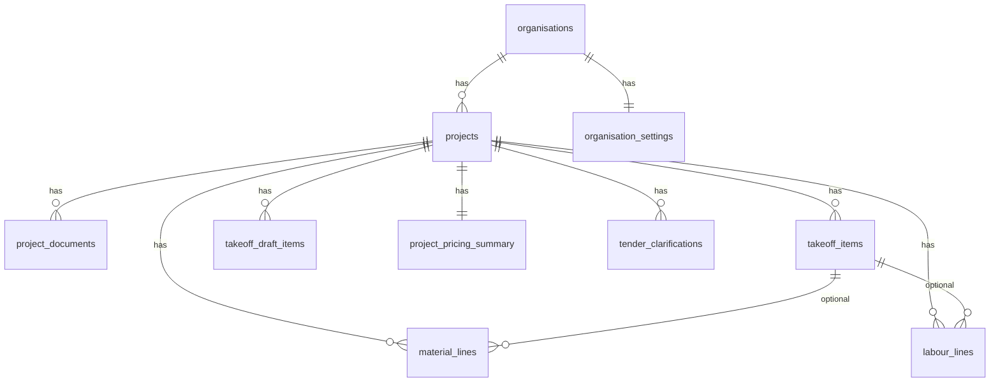

# Database schema

Conceptual schema for the Quanta MVP. Implementation uses **PostgreSQL** via **Supabase** with **Row Level Security (RLS)** on all tenant tables.

Naming convention: `snake_case` tables and columns; UUID primary keys; `timestamptz` for dates; monetary values as `numeric` (never float).

## Tenancy model

Every business object is scoped to an **organisation**. A user belongs to one organisation in MVP.

```
auth.users
    └── profiles (id, organisation_id, role)
            └── organisations
                    └── [all project and settings data]
```

### Profile roles

| Role | Purpose |
|------|---------|
| `owner` | Created the organisation; full control |
| `admin` | Manage team and settings (future) |
| `estimator` | Create and edit tenders |
| `viewer` | Read-only access (future) |

Users without `organisation_id` must complete `/onboarding` before accessing the app.

## Core entities

### profiles

User profile linked to Supabase Auth.

| Column | Type | Notes |
|--------|------|-------|
| id | uuid | PK, FK → auth.users |
| email | text | |
| full_name | text | Optional until onboarding |
| organisation_id | uuid | Nullable until onboarding complete |
| role | text | Nullable until onboarding; `owner`, `admin`, `estimator`, `viewer` |
| created_at, updated_at | timestamptz | |

### organisation_invites

Token-based invites for joining an organisation (MVP).

| Column | Type | Notes |
|--------|------|-------|
| id | uuid | PK |
| organisation_id | uuid | FK |
| token | text | Unique invite token |
| email | text | Optional restrict to email |
| role | text | `owner`, `admin`, `estimator`, `viewer` |
| status | text | `pending`, `accepted`, `revoked`, `expired` |
| invited_by | uuid | FK → auth.users |
| expires_at | timestamptz | Optional |
| accepted_at | timestamptz | |
| accepted_by | uuid | FK → auth.users |
| created_at, updated_at | timestamptz | |

Invite acceptance is performed via secure server paths only.

### organisations

Company profile shown on exports and used for defaults.

| Column | Type | Notes |
|--------|------|-------|
| id | uuid | PK |
| name | text | Trading name |
| legal_name | text | Optional |
| abn_or_company_number | text | Optional, region-specific |
| address, phone, email | text | Contact block for exports |
| logo_url | text | Supabase Storage path |
| default_currency | text | e.g. `AUD`, `GBP` |
| created_at, updated_at | timestamptz | |

### organisation_settings

Default rates and pricing behaviour (MVP “basic settings”).

| Column | Type | Notes |
|--------|------|-------|
| organisation_id | uuid | PK/FK |
| default_labour_rate | numeric | Per hour or unit — document in UI |
| default_margin_percent | numeric | |
| default_markup_percent | numeric | |
| overhead_percent | numeric | Optional |
| wastage_percent_default | numeric | Optional, overridable per line |
| created_at, updated_at | timestamptz | |

### projects

One tender/job estimate.

| Column | Type | Notes |
|--------|------|-------|
| id | uuid | PK |
| organisation_id | uuid | FK, indexed |
| name | text | e.g. “Level 3 fitout — Smith St” |
| reference | text | Client or internal job number |
| client_name | text | |
| site_address | text | Optional |
| tender_due_date | date | Optional |
| status | enum | `draft`, `in_review`, `submitted`, `won`, `lost`, `archived` |
| notes | text | Internal |
| created_by | uuid | FK → auth.users |
| created_at, updated_at | timestamptz | |

### project_documents

Files uploaded to a project (Storage object + metadata).

| Column | Type | Notes |
|--------|------|-------|
| id | uuid | PK |
| project_id | uuid | FK |
| organisation_id | uuid | FK (denormalised for RLS) |
| file_name | text | |
| storage_path | text | Supabase Storage key |
| mime_type | text | |
| file_size_bytes | bigint | |
| document_type | enum | `drawing`, `specification`, `schedule`, `other` |
| uploaded_by | uuid | |
| created_at | timestamptz | |

### takeoff_items (manual takeoff table)

Quantity lines before material/labour split. Manual entry is source of truth; AI drafts land in a separate table until approved.

| Column | Type | Notes |
|--------|------|-------|
| id | uuid | PK |
| project_id | uuid | FK |
| organisation_id | uuid | FK |
| sort_order | integer | |
| item_code | text | Optional BOQ code |
| description | text | |
| location | text | Optional zone/level |
| unit | text | e.g. `m²`, `lm`, `nr`, `item` |
| quantity | numeric | User-entered |
| waste_percent | numeric | Optional override |
| notes | text | |
| source | enum | `manual`, `ai_approved` |
| created_at, updated_at | timestamptz | |

### takeoff_draft_items (AI-assisted takeoff — not live until approved)

Staging area for AI proposals.

| Column | Type | Notes |
|--------|------|-------|
| id | uuid | PK |
| project_id | uuid | FK |
| organisation_id | uuid | FK |
| batch_id | uuid | Groups one AI run |
| description, unit, quantity | | Proposed values |
| confidence | numeric | Optional 0–1 |
| source_document_id | uuid | Optional FK |
| status | enum | `pending`, `accepted`, `rejected`, `edited` |
| created_at | timestamptz | |

### material_lines

Material takeoff / pricing lines linked to takeoff where useful.

| Column | Type | Notes |
|--------|------|-------|
| id | uuid | PK |
| project_id | uuid | FK |
| organisation_id | uuid | FK |
| takeoff_item_id | uuid | Nullable FK |
| description | text | |
| unit | text | |
| quantity | numeric | |
| unit_cost | numeric | |
| wastage_percent | numeric | |
| line_total | numeric | Stored or computed in app layer |
| sort_order | integer | |
| created_at, updated_at | timestamptz | |

### labour_lines

Labour build-up lines.

| Column | Type | Notes |
|--------|------|-------|
| id | uuid | PK |
| project_id | uuid | FK |
| organisation_id | uuid | FK |
| takeoff_item_id | uuid | Nullable FK |
| trade_or_role | text | e.g. “Ceiling fixer” |
| description | text | |
| hours_or_units | numeric | |
| rate | numeric | |
| line_total | numeric | |
| sort_order | integer | |
| created_at, updated_at | timestamptz | |

### project_pricing_summary

Cached totals for workspace header and export (recalculated on save).

| Column | Type | Notes |
|--------|------|-------|
| project_id | uuid | PK |
| organisation_id | uuid | FK |
| materials_subtotal | numeric | |
| labour_subtotal | numeric | |
| direct_cost_total | numeric | |
| margin_percent | numeric | Project override |
| markup_percent | numeric | Project override |
| margin_amount | numeric | |
| sell_price_total | numeric | |
| updated_at | timestamptz | |

### tender_clarifications

Exclusions, assumptions, and RFIs in one table with a type discriminator.

| Column | Type | Notes |
|--------|------|-------|
| id | uuid | PK |
| project_id | uuid | FK |
| organisation_id | uuid | FK |
| type | enum | `exclusion`, `assumption`, `rfi` |
| title | text | |
| body | text | |
| status | enum | For RFIs: `open`, `answered`, `closed` |
| sort_order | integer | |
| created_at, updated_at | timestamptz | |

### audit_events

Immutable log of user and system actions.

| Column | Type | Notes |
|--------|------|-------|
| id | uuid | PK |
| organisation_id | uuid | FK |
| project_id | uuid | Nullable FK |
| user_id | uuid | Nullable for system |
| entity_type | text | e.g. `takeoff_item`, `material_line` |
| entity_id | uuid | |
| action | enum | `create`, `update`, `delete`, `approve`, `reject`, `export` |
| before_json | jsonb | Optional snapshot |
| after_json | jsonb | Optional snapshot |
| summary | text | Human-readable |
| created_at | timestamptz | |

### ai_generation_runs

Track AI jobs for debugging and audit (no secrets in rows).

| Column | Type | Notes |
|--------|------|-------|
| id | uuid | PK |
| project_id | uuid | FK |
| organisation_id | uuid | FK |
| run_type | enum | `takeoff_draft` |
| status | enum | `queued`, `running`, `completed`, `failed` |
| model_version | text | |
| input_document_ids | uuid[] | |
| error_message | text | Nullable |
| created_by | uuid | |
| created_at, completed_at | timestamptz | |

## Relationships (summary)



## Storage buckets

| Bucket | Purpose |
|--------|---------|
| `organisation-logos` | Org branding |
| `project-documents` | Tender files per project |

Path pattern: `{organisation_id}/{project_id}/{document_id}/{filename}`

## Indexes (minimum)

- `projects(organisation_id, updated_at desc)`
- `takeoff_items(project_id, sort_order)`
- `material_lines(project_id)`, `labour_lines(project_id)`
- `audit_events(organisation_id, project_id, created_at desc)`

## Migrations and truth

- Schema changes via Supabase migrations only.
- Application reads/writes through Supabase client; no mock data when tables exist.
- Pricing totals: either generated columns/triggers or server-side recalculation on write — pick one approach per feature and document in implementation PRs.

## Related documents

- [security-rules.md](./security-rules.md) — RLS policies
- [build-sequence.md](./build-sequence.md) — Table rollout order
