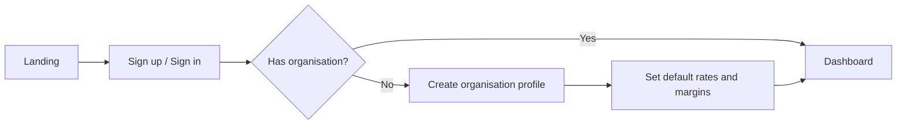

# User flows

End-to-end journeys for Quanta MVP. Each flow assumes an authenticated user with an organisation already created (see onboarding flow).

## 1. Onboarding and organisation setup

**Actor:** New subcontractor owner

**Goal:** Sign in and configure defaults before first tender.

| Step | User action | System response |
|------|-------------|-----------------|
| 1 | Opens Quanta, chooses sign up | Supabase Auth creates user |
| 2 | Completes email verification if required | Session established |
| 3 | Enters company name and contact details | `organisations` + `organisation_members` created |
| 4 | Sets default labour rate, margin %, markup % | `organisation_settings` saved |
| 5 | Lands on project dashboard | Empty state with “Create project” |

**Success:** User can create a project with org defaults applied.

---

## 2. Create project and open workspace

**Actor:** Estimator or owner

**Goal:** Start a new tender job in the workspace.

| Step | User action | System response |
|------|-------------|-----------------|
| 1 | Clicks “New project” | Form: name, client, reference, due date |
| 2 | Submits | `projects` row created (`status = draft`) |
| 3 | Opens project | Workspace tabs load (empty states) |
| 4 | Optionally edits overview metadata | Audit event `update` on project |

**Success:** Project appears in list; workspace URL is shareable within org (single-user MVP: bookmark for self).

---

## 3. Upload tender documents

**Actor:** Estimator

**Goal:** Attach drawings and specs for reference (and later AI).

| Step | User action | System response |
|------|-------------|-----------------|
| 1 | Goes to Documents tab | Lists existing uploads |
| 2 | Uploads PDF or image, picks type (drawing/spec/schedule) | File to Storage; `project_documents` row |
| 3 | Views or downloads file | Signed URL or proxy download |
| 4 | Deletes wrong file | Storage + row removed; audit logged |

**Success:** All tender files visible per project; no cross-project leakage.

---

## 4. Manual takeoff entry (primary path)

**Actor:** Estimator, trade lead

**Goal:** Build quantity schedule without AI.

| Step | User action | System response |
|------|-------------|-----------------|
| 1 | Opens Takeoff tab | Editable table of `takeoff_items` |
| 2 | Adds rows: description, unit, quantity, location | Rows persisted; sort order maintained |
| 3 | Edits or deletes rows | Immediate save; audit per change |
| 4 | Reorders rows | `sort_order` updated |

**Success:** Takeoff table reflects ground truth quantities; refresh does not lose data.

---

## 5. Material and labour build-up

**Actor:** Estimator

**Goal:** Price the job from takeoff and trade knowledge.

| Step | User action | System response |
|------|-------------|-----------------|
| 1 | Opens Materials tab | Table of `material_lines` |
| 2 | Adds materials (optional link to takeoff line) | Unit cost × qty (+ wastage) → line total |
| 3 | Opens Labour tab | Table of `labour_lines` |
| 4 | Adds labour; rate prefilled from org settings | User can override rate per line |
| 5 | Reviews section subtotals | Materials + labour subtotals shown |

**Success:** Direct cost build-up complete and linked to project.

---

## 6. Pricing, margin and markup

**Actor:** Owner, estimator

**Goal:** Arrive at sell price for tender.

| Step | User action | System response |
|------|-------------|-----------------|
| 1 | Opens Pricing tab | Shows direct cost total |
| 2 | Sets or accepts margin % and markup % | Project-level overrides optional |
| 3 | Reviews sell price and breakdown | `project_pricing_summary` updated |
| 4 | Saves | Audit records pricing snapshot |

**Success:** Sell price visible on project header; calculation transparent (show formula labels in UI).

---

## 7. Exclusions, assumptions and RFIs

**Actor:** Estimator

**Goal:** Document tender qualifications.

| Step | User action | System response |
|------|-------------|-----------------|
| 1 | Opens Clarifications tab | Filter or sections by type |
| 2 | Adds exclusion (“Not included: …”) | Row `type = exclusion` |
| 3 | Adds assumption (“Measured from IFC drawings”) | Row `type = assumption` |
| 4 | Adds RFI, marks answered when known | `status` on RFI rows |

**Success:** Clarifications ready for export and client communication.

---

## 8. Excel export

**Actor:** Estimator, QS reviewer

**Goal:** Offline review or submission pack.

| Step | User action | System response |
|------|-------------|-----------------|
| 1 | Opens Export tab | Summary of sheets included |
| 2 | Clicks “Export to Excel” | Server builds workbook from DB |
| 3 | Downloads file | Audit `export` event |
| 4 | Reviews in Excel | No Quanta account required for reviewer |

**Sheets (MVP):** Summary, Takeoff, Materials, Labour, Pricing, Clarifications.

**Success:** File matches in-app totals; exported at point in time.

---

## 9. AI-assisted takeoff draft (post-manual MVP)

**Actor:** Estimator

**Goal:** Speed up first draft; user remains in control.

| Step | User action | System response |
|------|-------------|-----------------|
| 1 | Selects documents for AI run | `ai_generation_runs` queued |
| 2 | Waits for completion | Draft rows in `takeoff_draft_items` |
| 3 | Reviews draft table side-by-side or inline | Confidence/source shown where available |
| 4 | Accepts, edits, or rejects each line | Accepted → copy to `takeoff_items`; rejected → no live impact |
| 5 | Continues with materials/pricing manually | Live tables unchanged for rejected lines |

**Success:** No AI line affects pricing until accepted; audit shows approve/reject actions.

---

## 10. Review activity and corrections

**Actor:** Owner, QS

**Goal:** See what changed before approving tender.

| Step | User action | System response |
|------|-------------|-----------------|
| 1 | Opens Activity tab | Chronological `audit_events` |
| 2 | Filters by entity or user | List updates |
| 3 | Corrects data in source table | New audit entry; export re-run for latest truth |

**Success:** Full traceability for takeoff and pricing changes.

---

## Flow priority for build

1. Onboarding (1)
2. Project create + workspace (2)
3. Documents (3)
4. Manual takeoff (4)
5. Materials + labour (5)
6. Pricing (6)
7. Clarifications (7)
8. Export + activity (8, 10)
9. AI draft (9) — last

## Related documents

- [build-sequence.md](./build-sequence.md)
- [ai-workflows.md](./ai-workflows.md)
- [product-scope.md](./product-scope.md)
