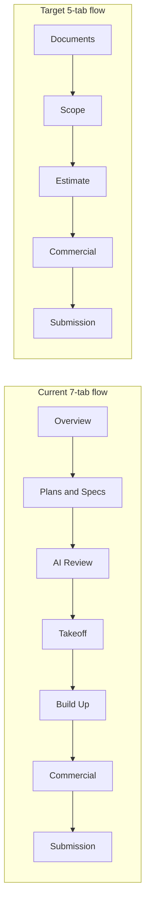

# Quanta Workflow Refactor Plan

**Version:** 1.0  
**Date:** 3 June 2026  
**Status:** Planning — no implementation in this document  
**Constraints:** UI/navigation refactor only — no database schema changes, no API contract changes required for launch

---

## Executive summary

Quanta’s project workspace will move from **seven tabs** to **five tabs**, aligned with how subcontractors think about a tender: files first, then scope, then cost build-up, then sell price, then submission.

| Current | Future |
|---------|--------|
| Overview | *(retired — content redistributed)* |
| Plans & Specs | **Documents** |
| AI Review | **Scope** |
| Takeoff | **Scope** |
| Build Up | **Estimate** |
| Commercial | **Commercial** |
| Submission | **Submission** |

**Target journey:** Documents → Scope → Estimate → Commercial → Submission.

---

## 1. Target model vs current model

| Current tab | Primary user question | Future tab | Rationale |
|-------------|----------------------|------------|-----------|
| **Overview** | What should I do next on this tender? | **Distributed** | Readiness and blockers live on the project shell and within workflow tabs — not a separate destination. |
| **Plans & Specs** | What tender files do we have? | **Documents** | Rename and narrow to **intake only**: upload, classify, drawing register, preview, inventory. |
| **AI Review** (+ document analysis in Plans & Specs) | What might be in these drawings? | **Scope** | Discovery and approval are scope formation, not document storage. |
| **Takeoff** | What are we measuring and linking? | **Scope** | Quantity schedule, drawing refs, packages on lines, standards. |
| **Build Up** | What does it cost to build? | **Estimate** | Materials, labour, package explosion, build-up issue resolution. |
| **Commercial** | What do we sell it for? | **Commercial** | Unchanged role. |
| **Submission** | What do we send? | **Submission** | Unchanged role. |

### Workflow diagram

---

## 2. Feature mapping

### 2.1 Documents (future)

| Feature (today) | Current location | Future location | Notes |
|-----------------|------------------|-----------------|-------|
| Document upload zone | Plans & Specs → Project documents panel | **Documents** | Primary CTA |
| Documents table (view / download / delete) | Plans & Specs | **Documents** | |
| Document classification groups | Plans & Specs cards | **Documents** | Filter or sidebar |
| Drawing register | Plans & Specs / documents panel | **Documents** | Sheet no, name, type, revision, page |
| Document preview | Documents components | **Documents** | |
| Storage / signed URLs | Server actions | **Documents** | Backend unchanged |
| Document analysis run UI | Plans & Specs → Document analysis panel | **Scope** | Moves out of Documents |
| Drawing selection for analysis | Document analysis panel | **Scope** | Uses register entry IDs |

### 2.2 Scope (future)

| Feature (today) | Current location | Future location | Notes |
|-----------------|------------------|-----------------|-------|
| Run document analysis (Gemini) | Plans & Specs | **Scope** → Discover scope | Same `analysis_runs` flow |
| Analysis run status / polling | Document analysis panel | **Scope** | |
| AI Review approval queue | AI Review tab | **Scope** → Review suggestions | Accept creates `takeoff_items` |
| AI review viewer / overlays / evidence | `components/ai-review/*` | **Scope** | |
| Trade focus and analysis mode | Document analysis | **Scope** | |
| Takeoff quantity table | Takeoff tab | **Scope** → Quantity schedule | Core scope artefact |
| Drawing reference on takeoff lines | Takeoff forms | **Scope** | |
| Apply package / bulk apply | Takeoff + scope review | **Scope** | Methodology on scope lines |
| Linked standards on project | Takeoff tab | **Scope** | |
| Takeoff relationships / source dialog | Takeoff context | **Scope** | |
| Bulk mark reviewed | Scope review / takeoff | **Scope** | |
| Scope gaps (package, drawing, standards) | Computed; fix → takeoff | **Scope** | Retarget fix navigation |
| Overview: scope gaps card | Overview | **Scope** header or sidebar | |

### 2.3 Estimate (future)

| Feature (today) | Current location | Future location | Notes |
|-----------------|------------------|-----------------|-------|
| Scope review issue table | Build Up → Scope review panel | **Estimate** → Build-up issues | Same logic, new tab |
| Materials panel | Build Up (expandable) | **Estimate** | Always visible (not hidden toggle) |
| Labour panel | Build Up (expandable) | **Estimate** | Always visible |
| Estimate generation | `estimate-generation/*` | **Estimate** | |
| Package explosion visibility | Materials / labour ↔ assemblies | **Estimate** | |
| Embedded pricing panel (deep link) | Scope review | **Commercial** preferred | Remove duplicate embed |
| Scope gaps: missing M/L generation | fix → build-up | fix → **estimate** | |

### 2.4 Commercial (future)

| Feature (today) | Current location | Future location | Notes |
|-----------------|------------------|-----------------|-------|
| Commercial metrics / cost composition | Commercial tab | **Commercial** | Keep |
| Pricing panel (sell, margin, markup) | Commercial (+ scope review embed) | **Commercial** | Single home for pricing UI |
| `priceTakeoff` deep link | URL param | **Commercial** | Keep query contract |
| Scope gaps: missing pricing | fix → commercial | **Commercial** | Unchanged |
| Overview: pricing readiness | Overview | **Commercial** summary | |

### 2.5 Submission (future)

| Feature (today) | Current location | Future location | Notes |
|-----------------|------------------|-----------------|-------|
| Tender validation / blockers | Submission | **Submission** | |
| Exclusions, assumptions, RFIs | Submission | **Submission** | |
| Tender pack preview | Submission + `/tender-pack-preview` | **Submission** | Route unchanged |
| Excel export | Submission | **Submission** | |
| Submission readiness | Submission | **Submission** | |
| Overview: submission readiness | Overview | **Submission** sticky status | |

### 2.6 Overview (retired as tab)

| Feature | Disposition |
|---------|-------------|
| Tender readiness metrics | Project header + workflow progress bar (5 steps) |
| Workflow step cards | Relabel: Documents → Scope → Estimate → Commercial → Submit |
| Project metadata (client, due date, risk) | App top bar / project header |
| Deep links to fix issues | Update to new tab slugs only |

### 2.7 Organisation level (unchanged)

Dashboard (Tender Command Centre), Templates, Standards, Rates, Imports, Settings — outside project workspace tabs.

---

## 3. Components

### 3.1 Keep (relocate; minimal logic change)

**Documents**

- `document-upload-zone`, `documents-table`, `document-preview-*`, `drawing-register-panel`
- `src/lib/documents/*`, `src/lib/documents/drawing-register/*`

**Scope**

- `project-takeoff-panel`, takeoff form and reference fields, `apply-package-dialog`, bulk takeoff UI
- `document-analysis-panel`, `document-analysis-status-panel`, `use-analysis-run-polling`
- Entire `components/ai-review/*` tree
- `ai-review-panel` (section composer)
- `takeoff-relationships-context`

**Estimate**

- `project-materials-panel`, `project-labour-panel`
- `scope-review-panel` (rename shell → Estimate workspace)
- `workflow-metric-cards` (estimate metrics)

**Commercial / Submission**

- `commercial-review-panel`, commercial composition / risk components
- `submission-panel`, `components/submission/*`, `components/export/*`

**Shared chrome**

- `project-workflow-progress-bar`
- `project-readiness-summary`, `project-scope-gaps-card`, `project-status-badge`

### 3.2 Merge

| New shell | Sources |
|-----------|---------|
| **DocumentsWorkspacePanel** | `plans-specs-panel` minus document analysis; `project-documents-panel`; classification cards |
| **ScopeWorkspacePanel** | `takeoff-tab-panel` + `ai-review-panel` + `document-analysis-panel`; standards section |
| **EstimateWorkspacePanel** | `build-up-panel` + `scope-review-panel` (visible M/L, issue table) |
| **Tab routing** | `tab-routing.ts`, `WorkspaceTabValue`, extended `LEGACY_TAB_MAP` |

### 3.3 Delete (tab shells only — not underlying features)

| Component | Reason |
|-----------|--------|
| `plans-specs-panel` | Replaced by Documents workspace |
| `build-up-panel` | Thin wrapper → Estimate workspace |
| `project-overview-panel` as tab | No Overview tab |
| Duplicate pricing in scope review | Commercial is canonical |

**Keep:** `scope-review-panel` logic — it becomes the Estimate core.

---

## 4. Database and API (unchanged)

### 4.1 Tables — no schema migration for this refactor

| Domain | Tables |
|--------|--------|
| Tenancy | `organisations`, `profiles`, `organisation_invites` |
| Project | `projects` |
| Documents | `documents`, `document_pages` |
| Scope / takeoff | `takeoff_items`, `takeoff_item_assemblies`, `assembly_packages`, `assembly_package_items` |
| AI | `ai_review_items`, `ai_review_segments`, `ai_review_approval_events`, `analysis_runs` |
| Estimate | `project_material_items`, `project_labour_items` |
| Commercial | `pricing_items` |
| Standards | `standards`, `standard_links` |
| Submission | `tender_clarifications`, `clarification_templates` |
| Rates / imports | `labour_rates`, `material_rates`, `supplier_rates`, `subcontractor_rates`, `import_batches` |

Table names (e.g. `takeoff_items`) stay as-is in the database.

### 4.2 API routes — unchanged

| Route | Role |
|-------|------|
| `POST /api/projects/[projectId]/analysis-runs/[runId]/process` | Background analysis processor |
| `GET/POST /api/diagnostics/gemini` | Diagnostics |

### 4.3 Server actions — unchanged (routing only)

All `"use server"` modules under `src/lib/**/actions.ts` keep their contracts. Examples:

- `documents/actions`, `drawing-register/actions`
- `ai-review/actions`, `ai-review/document-analysis/actions`
- `analysis-runs/actions`
- `takeoff/actions`, `takeoff-assembly/actions`
- `estimate-generation/actions`, `pricing/actions`
- `clarifications/actions`, `bulk-operations/actions`, `standards/actions`

---

## 5. Navigation changes

### 5.1 Project workspace tabs

| Slug (proposed) | Label | Replaces |
|-----------------|-------|----------|
| `documents` | Documents | `plans-specs`, legacy `documents`, `tender-inputs` |
| `scope` | Scope | `takeoff`, `ai-review` |
| `estimate` | Estimate | `build-up`, `materials`, `labour`, `scope-review` |
| `commercial` | Commercial | `commercial`, `pricing`, `commercial-review` |
| `submission` | Submission | `submission`, `clarifications`, `export` |

**Default tab:** `documents` (not `overview`).

### 5.2 Legacy URL mapping

Extend `LEGACY_TAB_MAP` in `src/lib/projects/tab-routing.ts`:

| Old `?tab=` | New tab |
|-------------|---------|
| `overview` | `documents` |
| `plans-specs`, `documents`, `tender-inputs` | `documents` |
| `ai-review` | `scope` |
| `takeoff` | `scope` |
| `build-up`, `materials`, `labour`, `scope-review` | `estimate` |
| `pricing`, `commercial-review` | `commercial` |
| `clarifications`, `export` | `submission` |

Keep `?priceTakeoff=` on **commercial**. Keep `?section=` on **submission**.

### 5.3 Workflow progress bar

| Current step | Future step |
|--------------|-------------|
| Upload | **Documents** |
| AI Review | **Scope** |
| Build Up | **Estimate** |
| Commercial | **Commercial** |
| Submit | **Submission** |

### 5.4 Scope gap fix navigation

Update `SCOPE_GAP_FIX_TAB` in `src/lib/scope-gaps/constants.ts`:

| Gap kind | Current | Future |
|----------|---------|--------|
| `missing_package`, `missing_drawing_reference`, `missing_standards_reference` | `takeoff` | **scope** |
| `missing_material_generation`, `missing_labour_generation` | `build-up` | **estimate** |
| `missing_pricing` | `commercial` | **commercial** |

### 5.5 Command palette

| Command | Current | Future |
|---------|---------|--------|
| Open plans / documents | `plans-specs` | `documents` |
| Open AI review | `ai-review` | `scope` |
| Open takeoff | `takeoff` | `scope` |
| Open build up | `build-up` | `estimate` |
| ctx-materials / ctx-labour | `build-up` | `estimate` |

### 5.6 In-tab anchors (proposed)

| Tab | Anchors |
|-----|---------|
| Documents | `#upload`, `#drawing-register` |
| Scope | `#discover-scope`, `#quantity-schedule`, `#ai-review` |
| Estimate | `#materials`, `#labour`, `#build-up-issues` |

### 5.7 Secondary route

`/projects/[id]/tender-pack-preview` — remains part of the **Submission** journey.

---

## 6. Highest-risk refactors

| # | Risk | Why | Mitigation |
|---|------|-----|------------|
| 1 | Tab slug and deep-link breakage | Bookmarks, scope-gap Fix, command palette, `priceTakeoff` | Legacy map for one release; log unknown tabs |
| 2 | Document analysis placement | Users run analysis from Plans & Specs today | Scope hosts “Discover scope”; link to Documents register |
| 3 | AI Review + Takeoff merge | Two tabs → one Scope tab | Sub-nav: Discover → Review → Quantity schedule |
| 4 | Build Up / Scope review overlap | Issues + M/L + optional pricing in one panel | Estimate owns M/L; Scope owns lines; single pricing home in Commercial |
| 5 | Workflow progress semantics | Steps tied to AI approval, not takeoff completeness | Product rule for “Scope complete” before implementation |
| 6 | Overview removal | No single project “home” tab | Sticky workflow bar + blockers on each tab |
| 7 | TakeoffRelationshipsProvider | Wraps full workspace today | Keep at workspace root |
| 8 | Full payload on project page | All data loaded in one server page | Defer route splitting until lazy-load design exists |
| 9 | Copy and training | Old names in docs and UI | Docs + in-app strings in dedicated pass |
| 10 | AI review pending badge | On `ai-review` tab | Move to **Scope** tab |

---

## 7. Phased migration plan

### Phase 0 — Design lock (1–2 days)

- Sign off tab slugs and sub-sections within Scope and Estimate.
- Define Scope “step complete” rules for the progress bar.
- **Exit:** Written acceptance criteria per tab.

### Phase 1 — Navigation shell only (low risk)

- Five tab triggers; existing panels behind new labels (composition unchanged).
- `WorkspaceTabValue`, `LEGACY_TAB_MAP`, `isWorkspaceTab` for new slugs.
- Retarget workflow progress bar.
- **Exit:** Old URLs resolve; build passes; no feature moves yet.

### Phase 2 — Documents tab (medium risk)

- `DocumentsWorkspacePanel`: upload, register, table, classification cards.
- Remove document analysis from Documents.
- Rename “Plans & specs” → “Documents”.
- **Exit:** Upload → register → preview without analysis on the same screen.

### Phase 3 — Scope tab (high risk)

- `ScopeWorkspacePanel`: analysis + AI review + takeoff + standards.
- Retire `ai-review` and `takeoff` tab triggers.
- Move pending-count badge to Scope.
- **Exit:** Upload → analyse → approve → edit takeoff in one tab flow.

### Phase 4 — Estimate tab (medium risk)

- `EstimateWorkspacePanel`: issues + always-visible materials and labour.
- Retire `build-up` tab; update scope-gap and command palette targets.
- Remove pricing embed from scope review (use Commercial).
- **Exit:** Package → explode → M/L → resolve gaps without old Build Up tab.

### Phase 5 — Commercial and Submission alignment (low risk)

- Commercial owns all sell-price UI; validation copy uses new tab names.
- **Exit:** `priceTakeoff` and submission `?section=` still work.

### Phase 6 — Retire Overview and cleanup (medium risk)

- Remove Overview tab content; redistribute readiness cards.
- Delete empty shells: `plans-specs-panel`, `build-up-panel`, overview tab panel.
- Update command index and dashboard deep links.
- **Exit:** Five tabs only; docs aligned (`user-flows.md`, `design-system.md`).

### Phase 7 — Polish (optional)

- Sub-tab persistence (`sessionStorage`).
- Empty states per workflow step.
- Analytics: `tab_view` with new slugs.

### Implementation order (summary)

1. Phase 0 — design lock  
2. Phase 1 — tab shell + legacy routing  
3. Phase 2 — Documents  
4. Phase 3 — Scope *(depends on Phase 2)*  
5. Phase 4 — Estimate  
6. Phase 5 — Commercial / Submission  
7. Phase 6 — Overview removal + cleanup  
8. Phase 7 — polish  

Phases 2 and 5 may overlap after Phase 1. Phase 3 must not start until analysis is removed from Documents.

---

## 8. Success criteria

- Project workspace shows exactly five tabs: **Documents, Scope, Estimate, Commercial, Submission**.
- Every capability in Section 2 is reachable without retired tab names in the UI.
- All legacy `?tab=` values resolve for at least one release cycle.
- No database migrations required for launch.
- No API route changes required for launch.
- User journey reads: **files → scope → cost build-up → sell price → tender pack**.

---

## 9. Key code touchpoints (reference)

| Area | Primary files |
|------|----------------|
| Tab shell | `components/projects/project-workspace-tabs.tsx` |
| Tab routing | `src/lib/projects/tab-routing.ts`, `src/lib/scope-gaps/types.ts` |
| Workflow steps | `src/lib/projects/workspace-steps.ts`, `project-workflow-progress-bar.tsx` |
| Scope gap fixes | `src/lib/scope-gaps/constants.ts`, `detect.ts` |
| Command palette | `src/lib/command/build-commands.ts`, `global-command-bar.tsx` |
| Panels today | `plans-specs-panel`, `ai-review-panel`, `takeoff-tab-panel`, `build-up-panel`, `scope-review-panel`, `commercial-review-panel`, `submission-panel`, `project-overview-panel` |
| Project data page | `app/(dashboard)/projects/[id]/page.tsx` |

---

## Document history

| Version | Date | Notes |
|---------|------|-------|
| 1.0 | 2026-06-03 | Initial plan from codebase audit and target 5-tab IA |

---

*This document is planning only. Implementation should follow the phased order above and preserve legacy navigation during rollout.*
